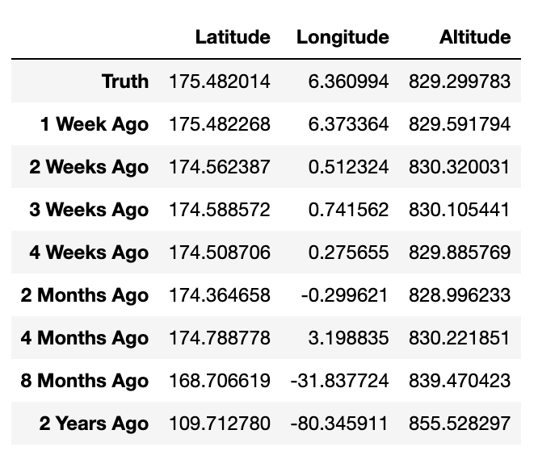
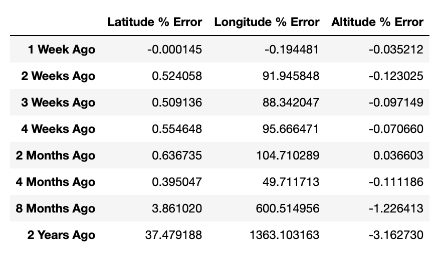
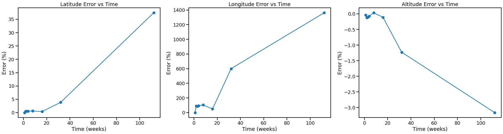

# Calculating Satellite Orbital Parameters from LTE's

Investigating the accuracy decay of orbital information over time on the Suomi NPP Satellite

## **Introduction**

The goal of this project is to confirm the necessity of obtaining satellite orbital information on a regular basis, as the predictions for future states become less certain over time. As orbital real estate becomes more and more crowded, this is a vital step to prevent collisions and maintain a safe operating environment. 

## **Method**

I acquired several historical LTE's for the Suomi NPP satellite from Space-Track.org ranging from January 2021 to present. I used each of these LTE's to predict what the orbital characteristics of the craft would be today, and compared to the current ground truth longitude, latitude, and altitude as of 1/11/2023 13:38:26 UTC. These parameters were calculated at intervals of 1 week, 2 weeks, 3 weeks, 4 weeks, 2 months, 4 months, 8 months, and 2 years ago. Finally, I plotted the errors at each interval to see if the prediction accuracy truly got worse over time.  

## **Results**

** Figure 1 ** shows a table of the raw data — the latitude, longitude, and altitude of the satellite on 1/11/2023, as well as the predictions for these parameters at each interval.

> Figure 1

** Figure 2 ** shows the percent error of these calculations compared to the ground truth.

> Figure 2

Finally, ** Figure 3 ** contains a plot of the error for each paramater vs the time interval at which the prediction was made.

## **Links**

[Jupyter Notebook](https://github.com/LindstromKyle/Calculating-Satellite-Orbital-Paramaters-from-LTEs/blob/main/Historical_TLEs.ipynb)  

